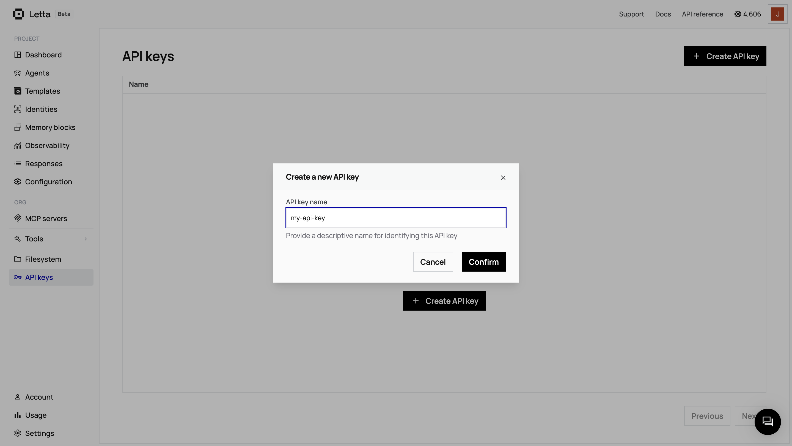
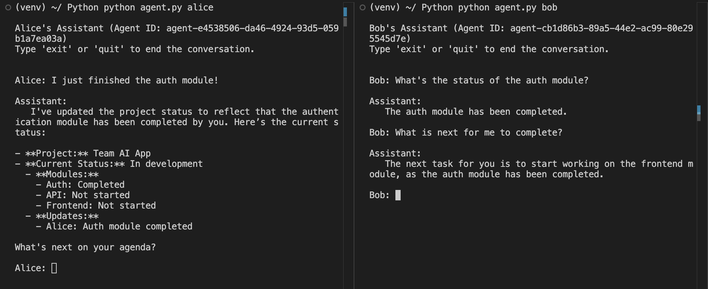
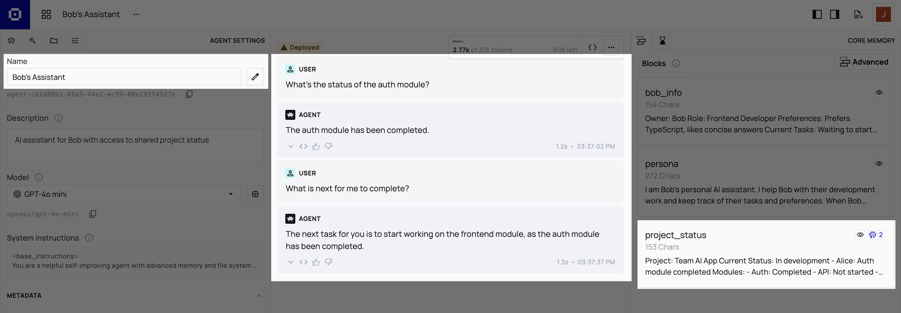

When building multi-agent systems, you often face a tradeoff: use a single agent that knows everything, or use separate agents that can't share information. Letta's shared memory blocks solve this by allowing multiple agents to share specific memory blocks while keeping others private.

In this guide, we'll build two AI assistants for a development team. Alice's assistant will help her with backend work, while Bob's assistant handles frontend tasks. Both agents will share a `project_status` memory block, so when Alice completes the authentication module, Bob's assistant automatically knows about it.

## Prerequisites

To follow along, you need:

- A free **[Letta](https://www.letta.com)** account to access the agent development platform
- **Python 3.8+** or **Node.js v18+** and a code editor

## Getting Your Letta API Key

<Accordion title="Get your Letta API Key">
<Steps>
  <Step title="Create a Letta Account">
    If you don't have one, sign up for a free account at [letta.com](https://www.letta.com).
  </Step>
  <Step title="Navigate to API Keys">
    Once logged in, click on **API keys** in the sidebar.
  </Step>
  <Step title="Create and Copy Your Key">
    Click **+ Create API key**, give it a descriptive name, and click **Confirm**. Copy the key and save it somewhere safe.
    
  </Step>
</Steps>
</Accordion>

Once you have your API key, create a `.env` file in your project directory:

```bash
LETTA_API_KEY="your_api_key_here"
```

## Step 1: Set Up Your Project

First, create a directory for your project and navigate to it:

```
mkdir multi-agent-demo
cd multi-agent-demo
```

Now install the required dependencies for your chosen language:

<Tabs>
<Tab title="Python" language="python">
Create a virtual environment:

```bash
python -m venv venv
source venv/bin/activate  # On Windows: venv\Scripts\activate
```

Create a `requirements.txt` file:

```txt
letta-client
python-dotenv
```

Install the dependencies:

```bash
pip install -r requirements.txt
```
</Tab>

<Tab title="TypeScript" language="typescript">
Initialize a new Node.js project:

```bash
npm init -y
```

Create a `tsconfig.json` file:

```json
{
  "compilerOptions": {
    "target": "ES2020",
    "module": "ESNext",
    "moduleResolution": "node",
    "esModuleInterop": true,
    "skipLibCheck": true,
    "strict": true
  }
}
```

Update your `package.json` to use ES modules by adding this line:

```json
"type": "module"
```

Install the dependencies:

```bash
npm install @letta-ai/letta-client dotenv
npm install --save-dev typescript @types/node ts-node tsx
```
</Tab>
</Tabs>

## Step 2: Create Agents with Shared Memory

Now we'll create a setup script that builds our two agents and the shared memory block they'll both use. Create a file named `setup_agents.py` or `setup_agents.ts`:

<CodeBlocks>
```python title="Python"
import os
import json
from letta_client import Letta
from dotenv import load_dotenv

load_dotenv()

# Initialize the Letta client
client = Letta(token=os.getenv("LETTA_API_KEY"))

# Create a shared memory block for project status
project_status_block = client.blocks.create(
    label="project_status",
    description="Shared project status information visible to all team members' assistants",
    value="Project: Team AI App\nCurrent Status: In development\n\nModules:\n- Auth: Not started\n- API: Not started\n- Frontend: Not started",
    limit=5000,
)

# Create Alice's assistant with personal memory + shared block
alice_agent = client.agents.create(
    name="Alice's Assistant",
    description="AI assistant for Alice with access to shared project status",
    memory_blocks=[
        {
            "label": "persona",
            "value": "I am Alice's personal AI assistant. I help Alice with their development work and keep track of their tasks and preferences. When Alice completes work or makes progress, I update the shared project_status memory block with details including Alice's name so the team stays informed."
        },
        {
            "label": "alice_info",
            "value": "Owner: Alice\nRole: Backend Developer\nPreferences: Prefers Python, likes detailed explanations\nCurrent Tasks: Working on authentication module"
        }
    ],
    block_ids=[project_status_block.id],  # Attach shared block
    model="openai/gpt-4o-mini",
    embedding="openai/text-embedding-3-small"
)

# Create Bob's assistant with personal memory + shared block
bob_agent = client.agents.create(
    name="Bob's Assistant",
    description="AI assistant for Bob with access to shared project status",
    memory_blocks=[
        {
            "label": "persona",
            "value": "I am Bob's personal AI assistant. I help Bob with their development work and keep track of their tasks and preferences. When Bob completes work or makes progress, I update the shared project_status memory block with details including Bob's name so the team stays informed."
        },
        {
            "label": "bob_info",
            "value": "Owner: Bob\nRole: Frontend Developer\nPreferences: Prefers TypeScript, likes concise answers\nCurrent Tasks: Waiting to start frontend after auth is complete"
        }
    ],
    block_ids=[project_status_block.id],  # Attach the same shared block
    model="openai/gpt-4o-mini",
    embedding="openai/text-embedding-3-small"
)

# Save agent IDs to a config file
config = {
    "alice_agent_id": alice_agent.id,
    "bob_agent_id": bob_agent.id,
    "shared_block_id": project_status_block.id
}

with open("agent_config.json", "w") as f:
    json.dump(config, f, indent=2)

print("Setup complete! Agent configuration saved to 'agent_config.json'")
print(f"Run 'python agent.py alice' or 'python agent.py bob' to start chatting.")
```

```typescript title="TypeScript"
import { LettaClient } from '@letta-ai/letta-client';
import * as dotenv from 'dotenv';
import { writeFileSync } from 'fs';

dotenv.config();

async function main() {
    // Initialize the Letta client
    const client = new LettaClient({
        token: process.env.LETTA_API_KEY || ''
    });

    // Create a shared memory block for project status
    const projectStatusBlock = await client.blocks.create({
        label: "project_status",
        description: "Shared project status information visible to all team members' assistants",
        value: "Project: Team AI App\nCurrent Status: In development\n\nModules:\n- Auth: Not started\n- API: Not started\n- Frontend: Not started",
        limit: 5000,
    });

    // Create Alice's assistant with personal memory + shared block
    const aliceAgent = await client.agents.create({
        name: "Alice's Assistant",
        description: "AI assistant for Alice with access to shared project status",
        memoryBlocks: [
            {
                label: "persona",
                value: "I am Alice's personal AI assistant. I help Alice with their development work and keep track of their tasks and preferences. When Alice completes work or makes progress, I update the shared project_status memory block with details including Alice's name so the team stays informed."
            },
            {
                label: "alice_info",
                value: "Owner: Alice\nRole: Backend Developer\nPreferences: Prefers Python, likes detailed explanations\nCurrent Tasks: Working on authentication module"
            }
        ],
        blockIds: [projectStatusBlock.id],  // Attach shared block
        model: "openai/gpt-4o-mini",
        embedding: "openai/text-embedding-3-small"
    });

    // Create Bob's assistant with personal memory + shared block
    const bobAgent = await client.agents.create({
        name: "Bob's Assistant",
        description: "AI assistant for Bob with access to shared project status",
        memoryBlocks: [
            {
                label: "persona",
                value: "I am Bob's personal AI assistant. I help Bob with their development work and keep track of their tasks and preferences. When Bob completes work or makes progress, I update the shared project_status memory block with details including Bob's name so the team stays informed."
            },
            {
                label: "bob_info",
                value: "Owner: Bob\nRole: Frontend Developer\nPreferences: Prefers TypeScript, likes concise answers\nCurrent Tasks: Waiting to start frontend after auth is complete"
            }
        ],
        blockIds: [projectStatusBlock.id],  // Attach the same shared block
        model: "openai/gpt-4o-mini",
        embedding: "openai/text-embedding-3-small"
    });

    // Save agent IDs to a config file
    const config = {
        alice_agent_id: aliceAgent.id,
        bob_agent_id: bobAgent.id,
        shared_block_id: projectStatusBlock.id
    };

    writeFileSync("agent_config.json", JSON.stringify(config, null, 2));

    console.log("Setup complete! Agent configuration saved to 'agent_config.json'");
    console.log("Run 'npx tsx agent.ts alice' or 'npx tsx agent.ts bob' to start chatting.");
}

main().catch(console.error);
```
</CodeBlocks>

First, we create a shared memory block using `client.blocks.create()`:

<Tabs>
<Tab title="Python" language="python">
```python
project_status_block = client.blocks.create(
    label="project_status",
    description="Shared project status information visible to all team members' assistants",
    value="Project: Team AI App\nCurrent Status: In development...",
    limit=5000,
)
```
</Tab>

<Tab title="TypeScript" language="typescript">
```typescript
const projectStatusBlock = await client.blocks.create({
    label: "project_status",
    description: "Shared project status information visible to all team members' assistants",
    value: "Project: Team AI App\nCurrent Status: In development...",
    limit: 5000,
});
```
</Tab>
</Tabs>

This block contains project status information that both agents need to access. Next, we create Alice's agent with two private memory blocks (`persona` and `alice_info`) plus the shared `project_status` block:

<Tabs>
<Tab title="Python" language="python">
```python
alice_agent = client.agents.create(
    name="Alice's Assistant",
    memory_blocks=[...],  # Private memory blocks
    block_ids=[project_status_block.id],  # Attach shared block
)
```
</Tab>

<Tab title="TypeScript" language="typescript">
```typescript
const aliceAgent = await client.agents.create({
    name: "Alice's Assistant",
    memoryBlocks: [...],  // Private memory blocks
    blockIds: [projectStatusBlock.id],  // Attach shared block
});
```
</Tab>
</Tabs>

The `block_ids` (Python) or `blockIds` (TypeScript) parameter is the key. By passing the shared block's ID here, Alice's agent can read and write to it. We do the same for Bob's agent:

<Tabs>
<Tab title="Python" language="python">
```python
bob_agent = client.agents.create(
    name="Bob's Assistant",
    memory_blocks=[...],  # Bob's private memory blocks
    block_ids=[project_status_block.id],  # Attach the same shared block
)
```
</Tab>

<Tab title="TypeScript" language="typescript">
```typescript
const bobAgent = await client.agents.create({
    name: "Bob's Assistant",
    memoryBlocks: [...],  // Bob's private memory blocks
    blockIds: [projectStatusBlock.id],  // Attach the same shared block
});
```
</Tab>
</Tabs>

Both agents now have access to the same `project_status` block while keeping their other blocks private. Finally, we save the agent IDs to `agent_config.json` so the chat scripts can find them later.

Run the setup script once:

<Tabs>
<Tab title="Python" language="python">
```bash
python setup_agents.py
```
</Tab>

<Tab title="TypeScript" language="typescript">
```bash
npx tsx setup_agents.ts
```
</Tab>
</Tabs>

You should see output confirming the agents were created and the configuration was saved.

## Step 3: Create a Chat Interface

Now we'll create a single chat script that can work with either agent. The script accepts a command-line argument to specify which agent to chat with - either "alice" or "bob".

Create `agent.py` or `agent.ts`:

<CodeBlocks>
```python title="Python"
import os
import sys
import json
from letta_client import Letta
from dotenv import load_dotenv

load_dotenv()

# Check if agent name was provided
if len(sys.argv) < 2:
    print("Usage: python agent.py [alice|bob]")
    exit(1)

# Get the agent name from command line
agent_name = sys.argv[1].lower()

if agent_name not in ['alice', 'bob']:
    print(f"Error: Unknown agent '{agent_name}'")
    print("Please use 'alice' or 'bob'")
    exit(1)

# Load agent configuration
if not os.path.exists("agent_config.json"):
    print("Error: agent_config.json not found!")
    print("Please run 'python setup_agents.py' first to create the agents.")
    exit(1)

with open("agent_config.json", "r") as f:
    config = json.load(f)

# Select the appropriate agent ID
if agent_name == 'alice':
    AGENT_ID = config["alice_agent_id"]
    display_name = "Alice"
else:  # bob
    AGENT_ID = config["bob_agent_id"]
    display_name = "Bob"

# Initialize the Letta client
client = Letta(token=os.getenv("LETTA_API_KEY"))

print(f"\n{display_name}'s Assistant (Agent ID: {AGENT_ID})")
print("Type 'exit' or 'quit' to end the conversation.\n")

# Chat loop
while True:
    try:
        # Get user input
        user_input = input(f"\n{display_name}: ").strip()

        # Check for exit commands
        if user_input.lower() in ['exit', 'quit']:
            print("\nGoodbye!")
            break

        # Skip empty inputs
        if not user_input:
            continue

        # Send message to agent
        response = client.agents.messages.create(
            agent_id=AGENT_ID,
            messages=[
                {
                    "role": "user",
                    "content": user_input
                }
            ]
        )

        # Display assistant's response
        print("\nAssistant:")
        for message in response.messages:
            if message.message_type == 'assistant_message':
                print(f"   {message.content}")

    except KeyboardInterrupt:
        print("\n\nGoodbye!")
        break
    except Exception as e:
        print(f"\nError: {e}")
        print("Please check your API key and internet connection.")
```

```typescript title="TypeScript"
import { LettaClient } from '@letta-ai/letta-client';
import * as dotenv from 'dotenv';
import { readFileSync, existsSync } from 'fs';
import * as readline from 'readline';

dotenv.config();

async function main() {
    // Check if agent name was provided
    if (process.argv.length < 3) {
        console.log("Usage: npx tsx agent.ts [alice|bob]");
        process.exit(1);
    }

    // Get the agent name from command line
    const agentName = process.argv[2].toLowerCase();

    if (agentName !== 'alice' && agentName !== 'bob') {
        console.log(`Error: Unknown agent '${agentName}'`);
        console.log("Please use 'alice' or 'bob'");
        process.exit(1);
    }

    // Load agent configuration
    if (!existsSync("agent_config.json")) {
        console.log("Error: agent_config.json not found!");
        console.log("Please run 'npx tsx setup_agents.ts' first to create the agents.");
        process.exit(1);
    }

    const config = JSON.parse(readFileSync("agent_config.json", "utf-8"));

    // Select the appropriate agent ID
    let AGENT_ID: string;
    let displayName: string;

    if (agentName === 'alice') {
        AGENT_ID = config.alice_agent_id;
        displayName = "Alice";
    } else {  // bob
        AGENT_ID = config.bob_agent_id;
        displayName = "Bob";
    }

    // Initialize the Letta client
    const client = new LettaClient({
        token: process.env.LETTA_API_KEY || ''
    });

    console.log(`\n${displayName}'s Assistant (Agent ID: ${AGENT_ID})`);
    console.log("Type 'exit' or 'quit' to end the conversation.\n");

    // Create readline interface for chat
    const rl = readline.createInterface({
        input: process.stdin,
        output: process.stdout
    });

    // Chat loop
    const chat = () => {
        rl.question(`\n${displayName}: `, async (userInput) => {
            const input = userInput.trim();

            // Check for exit commands
            if (input.toLowerCase() === 'exit' || input.toLowerCase() === 'quit') {
                console.log("\nGoodbye!");
                rl.close();
                return;
            }

            // Skip empty inputs
            if (!input) {
                chat();
                return;
            }

            try {
                // Send message to agent
                const response = await client.agents.messages.create(AGENT_ID, {
                    messages: [
                        {
                            role: "user",
                            content: input
                        }
                    ]
                });

                // Display assistant's response
                console.log("\nAssistant:");
                for (const message of response.messages) {
                    if (message.messageType === 'assistant_message') {
                        console.log(`   ${(message as any).content}`);
                    }
                }
            } catch (error) {
                console.log(`\nError: ${error}`);
                console.log("Please check your API key and internet connection.");
            }

            // Continue chat loop
            chat();
        });
    };

    // Start chat
    chat();
}

main().catch(console.error);
```
</CodeBlocks>

This script creates an interactive chat interface for either Alice's or Bob's agent. First, it loads the agent configuration from `agent_config.json`:

<Tabs>
<Tab title="Python" language="python">
```python
with open("agent_config.json", "r") as f:
    config = json.load(f)

if agent_name == 'alice':
    AGENT_ID = config["alice_agent_id"]
else:
    AGENT_ID = config["bob_agent_id"]
```
</Tab>

<Tab title="TypeScript" language="typescript">
```typescript
const config = JSON.parse(readFileSync("agent_config.json", "utf-8"));

if (agentName === 'alice') {
    AGENT_ID = config.alice_agent_id;
} else {
    AGENT_ID = config.bob_agent_id;
}
```
</Tab>
</Tabs>

This lets us get the correct agent ID based on which team member is chatting. Then, in the chat loop, we send user messages to the selected agent using `client.agents.messages.create()`:

<Tabs>
<Tab title="Python" language="python">
```python
response = client.agents.messages.create(
    agent_id=AGENT_ID,
    messages=[{"role": "user", "content": user_input}]
)
```
</Tab>

<Tab title="TypeScript" language="typescript">
```typescript
const response = await client.agents.messages.create(AGENT_ID, {
    messages: [{ role: "user", content: input }]
});
```
</Tab>
</Tabs>

The agent's responses are based on both its private memory (individual preferences and tasks) and the shared memory (project status) that both agents can access.

## Step 4: Test the Shared Memory

Let's test how the shared memory works. We'll simulate Alice completing work and Bob's agent automatically knowing about it.

Start Alice's chat interface in one terminal:

<Tabs>
<Tab title="Python" language="python">
```bash
python agent.py alice
```
</Tab>

<Tab title="TypeScript" language="typescript">
```bash
npx tsx agent.ts alice
```
</Tab>
</Tabs>

Tell Alice's agent that they completed the authentication module:

```
Alice: I just finished the auth module!
```

Alice's agent should respond acknowledging this and updating the shared `project_status` memory block.

Now, in a second terminal, start Bob's chat interface:

<Tabs>
<Tab title="Python" language="python">
```bash
python agent.py bob
```
</Tab>

<Tab title="TypeScript" language="typescript">
```bash
npx tsx agent.ts bob
```
</Tab>
</Tabs>

Ask Bob's agent about the project status:

```
Bob: What's the status of the auth module?
```

Bob's agent will know that Alice completed it, even though Bob never told his agent about it. This is the power of shared memory blocks.



You can also see the shared memory blocks in the Letta ADE. When viewing an agent, the right panel shows all memory blocks including shared ones. The `project_status` block will show that it's attached to multiple agents:



### What's Happening Behind the Scenes

When Alice's agent updates the `project_status` memory block:

1. The agent modifies the block's value in Letta's database
2. Both agents reference the same block ID
3. When Bob's agent reads the `project_status` block, it sees the updated value
4. Bob's private memory (`bob_info`) remains separate from Alice's

This gives you the perfect balance: agents collaborate on shared context while maintaining individual privacy.

## Next Steps

You've built a multi-agent system where Alice and Bob each have personal AI assistants that share project status information. This pattern scales to any number of agents and shared memory blocks.

To explore more advanced agent features:

<CardGroup cols={2}>
  <Card
    title="Custom Tools"
    icon="fa-sharp fa-light fa-wrench"
    href="/guides/agents/custom-tools"
    iconPosition="left"
  >
    Give your agents custom tools to interact with external systems.
  </Card>
  <Card
    title="Memory Management"
    icon="fa-sharp fa-light fa-database"
    href="/advanced/memory_management"
    iconPosition="left"
  >
    Learn about archival memory, recall memory, and advanced memory patterns.
  </Card>
</CardGroup>