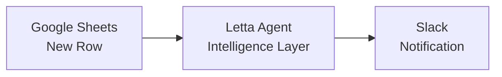

By the end of this tutorial, you'll have a support ticket routing system that adds Letta's stateful AI agents to your n8n workflows. Your agent will remember customer history, learn routing patterns, and provide intelligent recommendations.

Both n8n and Letta can be self-hosted if you need to run them on your own infrastructure (we'll cover self-hosting in a future guide).

## What You'll Build

We'll create a customer support workflow that demonstrates how to add Letta agents to n8n automations:



The Letta agent sits between your trigger and action, analyzing each ticket with full context from previous interactions. You'll build this visually on n8n's canvas by connecting nodes—no complex configuration required.

## Prerequisites

To follow along, you need free accounts for:

- **[Letta Cloud](https://app.letta.com)** - To create and host your stateful agent
- **[n8n Cloud](https://n8n.io)** - For workflow automation (14-day free trial, then $24/month)
- **[Google Sheets](https://sheets.google.com)** - For the ticket submission trigger
- **[Slack](https://slack.com)** - For team notifications (or any messaging app n8n supports)

You will also need Python 3.8+ or Node.js 18+ and a code editor.

## Getting Your API Key

We'll need an API key for Letta.

<Accordion title="Get your Letta API Key">
<Steps>
  <Step title="Create a Letta Account">
    If you don't have one, sign up for a free account at [letta.com](https://www.letta.com).
  </Step>
  <Step title="Navigate to API Keys">
    Once logged in, click on **API keys** in the sidebar.
    
  </Step>
  <Step title="Create and Copy Your Key">
    Click **+ Create API key**, give it a descriptive name (e.g., "n8n Integration"), and click **Confirm**. Copy the key and save it somewhere safe.
  </Step>
</Steps>
</Accordion>

Once you have these credentials, create a `.env` file in your project directory:

```bash
LETTA_API_KEY=your_letta_api_key_here
```

## Prepare Dependencies
<Steps>
  <Step>
    If you don't have an account, sign up at [n8n.io](https://n8n.io). You'll get a 14-day free trial of n8n Cloud.
  </Step>
  <Step>
    Create a new Google Sheet called "Support Tickets" with these columns:
      - `Ticket ID` (Column A)
      - `Customer Name` (Column B)
      - `Customer Email` (Column C)
      - `Subject` (Column D)
      - `Description` (Column E)
      - `Priority` (Column F)
  </Step>
  <Step>
    Make sure you have access to a Slack workspace where you can receive notifications. You'll connect it to n8n in Step 2.
  </Step>
</Steps>

## Step 1: Create the Letta Agent

First, we'll create a Letta agent configured with memory blocks for customer history and routing knowledge.

### Install Dependencies

<Tabs>
<Tab title="Python" language="python">
Create a `requirements.txt` file:

```txt
letta-client
python-dotenv
```

Install the dependencies:

```bash
pip install -r requirements.txt
```
</Tab>

<Tab title="TypeScript" language="typescript">
Create a `package.json` file:

```json
{
  "name": "letta-n8n-integration",
  "version": "1.0.0",
  "description": "TypeScript code for integrating Letta agents with n8n workflows",
  "type": "module",
  "scripts": {
    "create-agent": "tsx create-agent.ts",
    "test-ticket": "tsx test-ticket.ts"
  },
  "dependencies": {
    "@letta-ai/letta-client": "latest",
    "dotenv": "^16.3.1"
  },
  "devDependencies": {
    "@types/node": "^20.10.0",
    "tsx": "^4.7.0",
    "typescript": "^5.3.0"
  }
}
```

Create a `tsconfig.json` file:

```json
{
  "compilerOptions": {
    "target": "ES2020",
    "module": "ESNext",
    "moduleResolution": "node",
    "esModuleInterop": true,
    "skipLibCheck": true,
    "strict": true,
    "outDir": "./dist",
    "rootDir": "."
  },
  "include": [
    "*.ts"
  ],
  "exclude": [
    "node_modules",
    "dist"
  ]
}
```

Install the dependencies:

```bash
npm install
```
</Tab>
</Tabs>

### Create the Agent Script

Create a script to initialize your Letta agent with three memory blocks:

- **persona** - Defines the agent's role and behavior
- **routing_knowledge** - Tracks patterns about ticket routing
- **customer_history** - Maintains memory of customer interactions

<Tabs>
<Tab title="Python" language="python">
Create a file named `create-agent.py`:

```python
import os
from letta_client import Letta, CreateBlock
from dotenv import load_dotenv

# Load environment variables
load_dotenv()

def create_support_agent():
    """Create and configure a support ticket routing agent."""

    # Initialize the Letta client
    api_key = os.getenv("LETTA_API_KEY")
    if not api_key:
        raise ValueError("LETTA_API_KEY environment variable not set. Please add it to your .env file.")

    client = Letta(token=api_key)
    print("✓ Connected to Letta Cloud")

    # Create the agent with memory blocks
    agent = client.agents.create(
        name="Support Ticket Router",
        description="Intelligent support ticket routing assistant with customer memory and learning capabilities",
        memory_blocks=[
            CreateBlock(
                label="persona",
                value="""I am an intelligent support ticket routing assistant. My role is to:
- Analyze incoming support tickets with full context
- Remember customer history across all interactions
- Learn which routing decisions lead to fastest resolutions
- Provide detailed routing recommendations with reasoning
- Continuously improve my routing accuracy over time

I always provide structured responses with routing recommendations, priority levels, and context."""
            ),
            CreateBlock(
                label="routing_knowledge",
                value="""I track patterns about ticket routing and resolutions:
- Which teams handle which types of issues most effectively
- Average resolution times for different issue categories
- Patterns in urgent vs routine tickets
- Success rates of different routing decisions

I learn from each ticket to improve future routing decisions."""
            ),
            CreateBlock(
                label="customer_history",
                value="""I maintain memory of customer interactions:
- Previous tickets and their resolutions
- Communication preferences (technical level, urgency patterns)
- Account-specific issues and patterns
- Customer satisfaction indicators

I use this history to provide personalized, context-aware routing."""
            )
        ]
    )

    print(f"Agent created: {agent.id}")
    print(f"\nAdd this to your .env file:")
    print(f"LETTA_AGENT_ID={agent.id}")

    return agent

if __name__ == "__main__":
    try:
        agent = create_support_agent()
    except Exception as e:
        print(f"\nError creating agent: {e}")
        raise
```
</Tab>

<Tab title="TypeScript" language="typescript">
Create a file named `create-agent.ts`:

```typescript
import { LettaClient } from '@letta-ai/letta-client';
import * as dotenv from 'dotenv';

// Load environment variables
dotenv.config();

async function createSupportAgent() {
    /**
     * Create and configure a support ticket routing agent.
     */

    // Initialize the Letta client
    const apiKey = process.env.LETTA_API_KEY;
    if (!apiKey) {
        throw new Error("LETTA_API_KEY environment variable not set. Please add it to your .env file.");
    }

    const client = new LettaClient({ token: apiKey });
    console.log("✓ Connected to Letta Cloud");

    // Create the agent with memory blocks
    const agent = await client.agents.create({
        name: "Support Ticket Router",
        description: "Intelligent support ticket routing assistant with customer memory and learning capabilities",
        memoryBlocks: [
            {
                label: "persona",
                value: `I am an intelligent support ticket routing assistant. My role is to:
- Analyze incoming support tickets with full context
- Remember customer history across all interactions
- Learn which routing decisions lead to fastest resolutions
- Provide detailed routing recommendations with reasoning
- Continuously improve my routing accuracy over time

I always provide structured responses with routing recommendations, priority levels, and context.`
            },
            {
                label: "routing_knowledge",
                value: `I track patterns about ticket routing and resolutions:
- Which teams handle which types of issues most effectively
- Average resolution times for different issue categories
- Patterns in urgent vs routine tickets
- Success rates of different routing decisions

I learn from each ticket to improve future routing decisions.`
            },
            {
                label: "customer_history",
                value: `I maintain memory of customer interactions:
- Previous tickets and their resolutions
- Communication preferences (technical level, urgency patterns)
- Account-specific issues and patterns
- Customer satisfaction indicators

I use this history to provide personalized, context-aware routing.`
            }
        ]
    });

    console.log(`Agent created: ${agent.id}`);
    console.log(`\nAdd this to your .env file:`);
    console.log(`LETTA_AGENT_ID=${agent.id}`);

    return agent;
}

// Run the script
createSupportAgent().catch((error) => {
    console.error(`\nError creating agent: ${error.message}`);
    process.exit(1);
});
```
</Tab>
</Tabs>

### Run the Agent Creation Script

<CodeBlocks>
```bash title="Python" language="python"
python create-agent.py
```

```bash title="TypeScript" language="typescript"
npx tsx create-agent.ts
```
</CodeBlocks>

You should see output like:

```
Connected to Letta Cloud
Agent created: agent-abc123def456

Add this to your .env file:
LETTA_AGENT_ID=agent-abc123def456
```

### Save the Agent ID

Copy the agent ID and add it to your `.env` file:

```bash
LETTA_API_KEY=your_letta_api_key_here
LETTA_AGENT_ID=agent-abc123def456
```

### Test Your Agent

Before connecting to n8n, you can test that your agent analyzes tickets correctly.

<AccordionGroup>
<Accordion title="Create the Test Script">

This script sends sample support tickets to your agent and displays the routing recommendations.

<Tabs>
<Tab title="Python" language="python">
Create a file named `test-ticket.py`:

```python
import os
import json
from letta_client import Letta
from dotenv import load_dotenv

# Load environment variables
load_dotenv()

# Sample test tickets
SAMPLE_TICKETS = [
    {
        "customer_name": "John Doe",
        "customer_email": "john.doe@example.com",
        "subject": "Cannot log in to dashboard",
        "description": "I'm getting a 500 error when trying to log in. This is the third time this month.",
        "priority": "High"
    },
    {
        "customer_name": "Sarah Smith",
        "customer_email": "sarah.smith@company.com",
        "subject": "Question about billing",
        "description": "I was charged twice for my subscription this month. Can someone look into this?",
        "priority": "Medium"
    },
    {
        "customer_name": "Mike Johnson",
        "customer_email": "mike.j@startup.io",
        "subject": "Feature request",
        "description": "Would love to see dark mode added to the app. Many users have been asking for this.",
        "priority": "Low"
    }
]

def format_ticket_message(ticket):
    """Format a ticket into a message for the Letta agent."""
    return f"""New support ticket received:

Customer: {ticket['customer_name']} ({ticket['customer_email']})
Subject: {ticket['subject']}
Description: {ticket['description']}
Priority: {ticket['priority']}

Please analyze this ticket and provide:
1. Recommended team to route to
2. Adjusted priority level (if needed)
3. Your reasoning based on customer history and patterns
4. A suggested response message
5. Estimated resolution time"""

def send_ticket_to_agent(client, agent_id, ticket):
    """Send a ticket to the Letta agent and get routing recommendation."""

    # Send message to agent
    message_content = format_ticket_message(ticket)

    response = client.agents.messages.create(
        agent_id=agent_id,
        messages=[
            {
                "role": "user",
                "content": message_content
            }
        ]
    )

    # Extract and display the agent's response
    for message in response.messages:
        if message.message_type == 'assistant_message':
            print(message.content)
            print()

    return response

def main():
    """Main test function."""

    # Get credentials from environment
    api_key = os.getenv("LETTA_API_KEY")
    agent_id = os.getenv("LETTA_AGENT_ID")

    if not api_key:
        raise ValueError("LETTA_API_KEY not set. Add it to your .env file.")

    if not agent_id:
        raise ValueError("LETTA_AGENT_ID not set. Run create-agent.py first and add the ID to your .env file.")

    # Initialize client
    client = Letta(token=api_key)
    print("Connected to Letta Cloud")
    print(f"Using agent: {agent_id}\n")

    # Test with sample tickets
    for i, ticket in enumerate(SAMPLE_TICKETS, 1):
        print(f"Processing ticket {i}/{len(SAMPLE_TICKETS)}: {ticket['subject']}")
        try:
            send_ticket_to_agent(client, agent_id, ticket)
        except Exception as e:
            print(f"Failed: {e}")
            continue

if __name__ == "__main__":
    try:
        main()
    except Exception as e:
        print(f"Error: {e}")
        raise
```
</Tab>

<Tab title="TypeScript" language="typescript">
Create a file named `test-ticket.ts`:

```typescript
import { LettaClient } from '@letta-ai/letta-client';
import * as dotenv from 'dotenv';

// Load environment variables
dotenv.config();

interface Ticket {
    customer_name: string;
    customer_email: string;
    subject: string;
    description: string;
    priority: string;
}

// Sample test tickets
const SAMPLE_TICKETS: Ticket[] = [
    {
        customer_name: "John Doe",
        customer_email: "john.doe@example.com",
        subject: "Cannot log in to dashboard",
        description: "I'm getting a 500 error when trying to log in. This is the third time this month.",
        priority: "High"
    },
    {
        customer_name: "Sarah Smith",
        customer_email: "sarah.smith@company.com",
        subject: "Question about billing",
        description: "I was charged twice for my subscription this month. Can someone look into this?",
        priority: "Medium"
    },
    {
        customer_name: "Mike Johnson",
        customer_email: "mike.j@startup.io",
        subject: "Feature request",
        description: "Would love to see dark mode added to the app. Many users have been asking for this.",
        priority: "Low"
    }
];

function formatTicketMessage(ticket: Ticket): string {
    /**
     * Format a ticket into a message for the Letta agent.
     */
    return `New support ticket received:

Customer: ${ticket.customer_name} (${ticket.customer_email})
Subject: ${ticket.subject}
Description: ${ticket.description}
Priority: ${ticket.priority}

Please analyze this ticket and provide:
1. Recommended team to route to
2. Adjusted priority level (if needed)
3. Your reasoning based on customer history and patterns
4. A suggested response message
5. Estimated resolution time`;
}

async function sendTicketToAgent(client: LettaClient, agentId: string, ticket: Ticket) {
    /**
     * Send a ticket to the Letta agent and get routing recommendation.
     */

    // Send message to agent
    const messageContent = formatTicketMessage(ticket);

    const response = await client.agents.messages.create(agentId, {
        messages: [
            {
                role: "user",
                content: messageContent
            }
        ]
    });

    // Extract and display the agent's response
    for (const message of response.messages) {
        if (message.messageType === 'assistant_message') {
            console.log((message as any).content);
            console.log();
        }
    }

    return response;
}

async function main() {
    /**
     * Main test function.
     */

    // Get credentials from environment
    const apiKey = process.env.LETTA_API_KEY;
    const agentId = process.env.LETTA_AGENT_ID;

    if (!apiKey) {
        throw new Error("LETTA_API_KEY not set. Add it to your .env file.");
    }

    if (!agentId) {
        throw new Error("LETTA_AGENT_ID not set. Run create-agent.ts first and add the ID to your .env file.");
    }

    // Initialize client
    const client = new LettaClient({ token: apiKey });
    console.log("Connected to Letta Cloud");
    console.log(`Using agent: ${agentId}\n`);

    // Test with sample tickets
    for (let i = 0; i < SAMPLE_TICKETS.length; i++) {
        const ticket = SAMPLE_TICKETS[i];
        console.log(`Processing ticket ${i + 1}/${SAMPLE_TICKETS.length}: ${ticket.subject}`);

        try {
            await sendTicketToAgent(client, agentId, ticket);
        } catch (error: any) {
            console.error(`Failed: ${error.message}`);
            continue;
        }
    }
}

// Run the script
main().catch((error) => {
    console.error(`Error: ${error.message}`);
    process.exit(1);
});
```
</Tab>
</Tabs>

</Accordion>

<Accordion title="Run the Test Script">

<CodeBlocks>
```bash title="Python" language="python"
python test-ticket.py
```

```bash title="TypeScript" language="typescript"
npx tsx test-ticket.ts
```
</CodeBlocks>

You should see intelligent routing recommendations for each ticket:

```
Connected to Letta Cloud
Using agent: agent-abc123def456

Processing ticket 1/3: Cannot log in to dashboard
Based on the ticket analysis:

Recommended Team: Engineering - Backend
Priority Level: High
Reasoning: Customer John Doe has reported login issues...

Estimated Resolution Time: 2-4 hours

Processing ticket 2/3: Question about billing
...
```

If you see context-aware responses, your agent is working correctly.

</Accordion>

<Accordion title="View Your Agent in the ADE">

You can also view your agent in Letta's Agent Development Environment (ADE), a visual interface for managing and inspecting agents.

1. Go to [https://app.letta.com](https://app.letta.com) and sign in with your Letta account

2. You'll see your agents list. Find your **Support Ticket Router** agent

   

3. Click on the agent to open it in the ADE

   

4. In the ADE, you can inspect your agent's configuration:
   - **Memory blocks** (persona, routing_knowledge, customer_history) in the right panel
   - **System instructions** and behavior settings in the left panel
   - **Chat interface** in the center where the agent will process tickets

5. If you ran the test script, you can see the conversation history and responses in the chat interface

   

The ADE provides full visibility into your agent's configuration and state. When your n8n workflow runs, you can return to the ADE to see how the agent's memory evolves as it processes real support tickets.

<a href="/guides/ade/overview" target="_blank" rel="noopener noreferrer">Learn more about the Agent Development Environment →</a>

</Accordion>
</AccordionGroup>

## Step 2: Configure n8n

Now we'll connect your Letta agent to n8n to create the automated workflow.

### Create the Google Sheets Trigger

<Steps>
  <Step title="Create a New Workflow">
    In your n8n instance, click **Create workflow** or navigate to an existing workflow.

    
  </Step>

  <Step title="Add the Google Sheets Trigger">
    1. Click the **+** button on the canvas
    2. Search for and select **Google Sheets**
    3. Choose trigger: **On row added**
    4. In the **Credential to connect with** dropdown, select the dropdown, then select **+ Create new credential**. Click **Sign in with Google**.
    5. In the **Document** dropdown, select your **Support Tickets** spreadsheet
    6. In the **Sheet** dropdown, select **Sheet1** (or whatever your sheet is named)
    7. Navigate to the **Settings** tab and toggle **Always Output Data** on

    
  </Step>

  <Step title="Test the Trigger">
    1. Add a sample row to your Google Sheet with test data
    2. Click **Fetch Test Event** in n8n
    3. n8n should find your sample row and display the data
    4. Verify the field names match your column headers

    
  </Step>
</Steps>

### Add the Letta Agent Action

This step sends the ticket data to your Letta agent for analysis.

<Steps>
  <Step title="Add an HTTP Request Node">
    1. Click the **+** button on the canvas after the Google Sheets node
    2. Search for and select **HTTP Request**
  </Step>

  <Step title="Configure the Request Method and URL">
    1. In **Method**, select **POST**
    2. In the **URL** field, enter:

    ```
    https://api.letta.com/v1/agents/YOUR_AGENT_ID_HERE/messages
    ```

    Replace `YOUR_AGENT_ID_HERE` with the agent ID from Step 1.
  </Step>

  <Step title="Add Headers">
    1. **Send Headers:** Toggle to **On**
    2. Add the Authorization header:
       - **Name:** `Authorization`
       - **Value:** `Bearer YOUR_LETTA_API_KEY` (Replace `YOUR_LETTA_API_KEY` with your actual Letta API key)
    4. Click **Add Parameter** to add another header:
       - **Name:** `Content-Type`
       - **Value:** `application/json`

    
  </Step>

  <Step title="Configure the Request Body">
    1. **Send Body:** Toggle to **On**
    2. **Body Content Type:** Select **Using JSON**
    3. **Specify Body:** Select **Using JSON**

    Click into the **JSON** field and paste:

    ```json
    {
      "messages": [
        {
          "role": "user",
          "content": "New support ticket received:\n\nCustomer: {{ $json['Customer Name'] }} ({{ $json['Customer Email'] }})\nSubject: {{ $json.Subject }}\nDescription: {{ $json.Description }}\nPriority: {{ $json.Priority }}\n\nPlease analyze this ticket and provide:\n1. Recommended team to route to\n2. Adjusted priority level (if needed)\n3. Your reasoning based on customer history and patterns\n4. A suggested response message\n5. Estimated resolution time"
        }
      ]
    }
    ```

    <Note>
    n8n uses `{{ $json.FieldName }}` syntax to reference data from the previous node. If your column headers have spaces, use bracket notation like `{{ $json['Customer Name'] }}`. Fields without spaces can use dot notation like `{{ $json.Subject }}`.
    </Note>

    
  </Step>

  <Step title="Test the HTTP Request">
    1. Click **Execute step**
    2. Wait for the response (may take a few seconds)
    3. You should see a response with a `messages` array
    4. Expand the response to verify the agent's routing recommendation is present in `messages[0].content`

    You can also verify the test worked by checking your agent in the ADE at [https://app.letta.com](https://app.letta.com). You should see the test ticket in the conversation history.

    
  </Step>
</Steps>

### Add the Slack Notification Action

<Steps>
  <Step title="Add a Slack Node">
    1. Click the **+** button after the HTTP Request node
    2. Search for and select **Slack**
    3. Choose action: **Send a Message**
  </Step>

  <Step title="Configure Slack Authentication">
    1. In the **Credential to connect with** dropdown, select **+ Create new credential**
    2. Click **Connect my account**
    3. Follow the prompts to authorize n8n to access your Slack workspace
  </Step>

  <Step title="Configure the Slack Message">
    1. **Resource:** `Message`
    2. **Operation:** `Send`
    3. **Send Message To:** **Channel**
    4. **Channel:** Select or type your channel (e.g., `#support`)
    4. **Message Text:** Click into the text field and build your message:

    ```
    *New Support Ticket*

    *Customer:* {{ $('Google Sheets Trigger').item.json['Customer Name'] }} ({{ $('Google Sheets Trigger').item.json['Customer Email'] }})
    *Subject:* {{ $('Google Sheets Trigger').item.json.Subject }}
    *Description:* {{ $('Google Sheets Trigger').item.json.Description }}
    *Priority:* {{ $('Google Sheets Trigger').item.json.Priority }}

    ---

    *Letta AI Recommendation:*

    {{ $json.messages[0].content }}

    ---

    View Ticket in Sheets
    ```

    <Note>
    To reference data from the Google Sheets trigger, use `{{ $('Google Sheets Trigger').item.json.FieldName }}`. To reference the Letta agent's response from the current node input, use `{{ $json.messages[0].content }}`.
    </Note>
  </Step>

  <Step title="Test the Slack Message">
    1. Click **Execute step**

    

    2. Check your Slack channel
    3. You should see a formatted message with the ticket details and agent recommendation

    
  </Step>
</Steps>

### Activate Your Workflow

<Steps>
  <Step title="Save Your Workflow">
    Click **Save** in the top right and name your workflow (e.g., "Intelligent Support Ticket Routing")
  </Step>

  <Step title="Activate the Workflow">
    1. Toggle the workflow to **Active** using the toggle in the top right

    
  </Step>
</Steps>

Your n8n workflow is now live and will process new support tickets automatically.

## Testing the Complete Flow

Add an example ticket to your Google Sheet:

| Ticket ID | Customer Name | Customer Email | Subject | Description | Priority |
|-----------|---------------|----------------|---------|-------------|----------|
| 1 | James Doe | james@example.com | Cannot access account | Getting an error when logging in | High |

Wait 1-2 minutes for n8n to detect the new row (polling interval varies). You should receive a Slack notification with:

- The ticket details from Google Sheets
- Letta's intelligent routing recommendation with reasoning
- A suggested response message
- Estimated resolution time

Try adding another ticket from the same customer. The agent will remember the first interaction and provide context-aware routing based on the customer's history.


## Next Steps

Now that you've integrated a Letta agent into your n8n workflow, you can apply this same pattern to other use cases like lead qualification, content moderation, or expense approval.

Both n8n and Letta support self-hosted deployment, giving you full ownership of your automation infrastructure. We'll cover how to self-host both platforms in a future guide.

To extend what you've built, explore these guides:

<CardGroup cols={2}>
  <Card
    title="Custom Tools"
    icon="fa-sharp fa-light fa-wrench"
    href="/guides/agents/custom-tools"
    iconPosition="left"
  >
    Learn how to create custom tools to extend your agent's capabilities beyond message handling.
  </Card>
  <Card
    title="Memory Management"
    icon="fa-sharp fa-light fa-brain"
    href="/guides/agents/memory"
    iconPosition="left"
  >
    Explore how to customize memory blocks for different workflow requirements.
  </Card>
</CardGroup>
