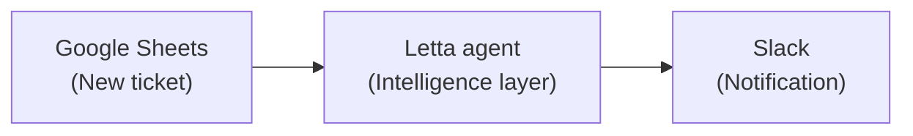
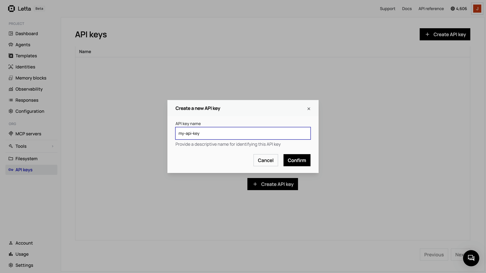

Letta's stateful AI agents can enrich existing Zapier workflows. This guide demonstrates how to create a routing system for customer support tickets by integrating Zapier automation with a Letta agent. The agent remembers customer history, learns routing patterns, and provides intelligent recommendations.

## What you'll build

You'll create the following customer support workflow, and in doing so, learn to add Letta agents to Zapier automations:



The Letta agent sits between your trigger and action, analyzing each ticket with full context from previous interactions. This approach adds intelligence to your workflow without replacing your existing tools.

## Prerequisites

To follow along, you need:

- **A free [Letta Cloud](https://app.letta.com) account:** For creating and hosting your stateful agent
- **A [Zapier](https://zapier.com) account:** For workflow automation (a free trial or **Pro** plan is required for Webhooks)
- **[Google Sheets](https://sheets.google.com):** For the ticket submission trigger
- **[Slack](https://slack.com) (or any messaging app Zapier supports):** For team notifications
- **Python** (version 3.8 or later) or **Node.js** (version 18 or later)
- **A code editor**

### Get your Letta API key

<AccordionGroup>
<Accordion title="Get your Letta API key">
<Steps>
  <Step title="Create a Letta account">
    If you don't have one, sign up for a free account at [letta.com](https://www.letta.com).
  </Step>
  <Step title="Navigate to API keys">
    Once logged in, click on **API keys** in the sidebar.
    
  </Step>
  <Step title="Create and copy your key">
    Click **+ Create API key**, give it a descriptive name (such as `Zapier Integration`), and click **Confirm**. Copy the key and save it somewhere safe.
  </Step>
</Steps>
</Accordion>
</AccordionGroup>

Once you have your API key, create a `.env` file in your project directory:

```bash
LETTA_API_KEY=your_letta_api_key_here
```
### Prepare the project dependencies
<Steps>
  <Step>
    If you don't have an account, sign up at [zapier.com](https://zapier.com). The free tier works for this tutorial.
  </Step>
  <Step>
    Create a new Google Sheet, called `Support Tickets`, with the following columns:
      - `Ticket ID` (Column A)
      - `Customer Name` (Column B)
      - `Customer Email` (Column C)
      - `Subject` (Column D)
      - `Description` (Column E)
      - `Priority` (Column F)
  </Step>
  <Step>
    Make sure you have access to a Slack workspace where you can receive notifications (you'll connect the workspace to Zapier in Step 3).
  </Step>
</Steps>

## Step 1: Create the Letta agent

First, configure a Letta agent with memory blocks for customer history and routing knowledge.

### Install the dependencies

<Tabs>
<Tab title="Python" language="python">
Create a `requirements.txt` file that contains the following dependencies:

```txt
letta-client
python-dotenv
```

Run the following code to install the dependencies:

```bash
pip install -r requirements.txt
```
</Tab>

<Tab title="TypeScript" language="typescript">
Create a `package.json` file with the following contents:

```json
{
  "name": "letta-zapier-integration",
  "version": "1.0.0",
  "description": "TypeScript code for integrating Letta agents with Zapier workflows",
  "type": "module",
  "scripts": {
    "create-agent": "tsx create-agent.ts",
    "test-ticket": "tsx test-ticket.ts"
  },
  "dependencies": {
    "@letta-ai/letta-client": "latest",
    "dotenv": "^16.3.1"
  },
  "devDependencies": {
    "@types/node": "^20.10.0",
    "tsx": "^4.7.0",
    "typescript": "^5.3.0"
  }
}
```

Create a `tsconfig.json` file with the following contents:

```json
{
  "compilerOptions": {
    "target": "ES2020",
    "module": "ESNext",
    "moduleResolution": "node",
    "esModuleInterop": true,
    "skipLibCheck": true,
    "strict": true,
    "outDir": "./dist",
    "rootDir": "."
  },
  "include": [
    "*.ts"
  ],
  "exclude": [
    "node_modules",
    "dist"
  ]
}
```

Install the dependencies:

```bash
npm install
```
</Tab>
</Tabs>

### Create the agent script

Create a script to initialize your Letta agent with three memory blocks:

- A `persona` block to define the agent's role and behavior
- A `routing_knowledge` block to track ticket-routing patterns
- A `customer_history` block to maintain the memory of customer interactions

<Tabs>
<Tab title="Python" language="python">
Create a file named `create-agent.py` and add the following code to it:

```python
"""
Create a Letta agent for intelligent support ticket routing.

This script creates a Letta agent with memory blocks designed to:
- Remember customer history across all interactions
- Learn routing patterns that lead to faster resolutions
- Provide context-aware ticket analysis and routing recommendations

Usage:
    python create-agent.py

Requirements:
    - LETTA_API_KEY environment variable set
    - letta-client package installed
"""

import os
from letta_client import Letta, CreateBlock
from dotenv import load_dotenv

# Load environment variables
load_dotenv()

def create_support_agent():
    """Create and configure a support ticket routing agent."""

    # Initialize the Letta client
    api_key = os.getenv("LETTA_API_KEY")
    if not api_key:
        raise ValueError("LETTA_API_KEY environment variable not set. Please add it to your .env file.")

    client = Letta(token=api_key)
    print("Connected to Letta Cloud")

    # Create the agent with memory blocks
    agent = client.agents.create(
        name="Support Ticket Router",
        description="Intelligent support ticket routing assistant with customer memory and learning capabilities",
        memory_blocks=[
            CreateBlock(
                label="persona",
                value="""I am an intelligent support ticket routing assistant. My role is to:
- Analyze incoming support tickets with full context
- Remember customer history across all interactions
- Learn which routing decisions lead to fastest resolutions
- Provide detailed routing recommendations with reasoning
- Continuously improve my routing accuracy over time

I always provide structured responses with routing recommendations, priority levels, and context."""
            ),
            CreateBlock(
                label="routing_knowledge",
                value="""I track patterns about ticket routing and resolutions:
- Which teams handle which types of issues most effectively
- Average resolution times for different issue categories
- Patterns in urgent vs routine tickets
- Success rates of different routing decisions

I learn from each ticket to improve future routing decisions."""
            ),
            CreateBlock(
                label="customer_history",
                value="""I maintain memory of customer interactions:
- Previous tickets and their resolutions
- Communication preferences (technical level, urgency patterns)
- Account-specific issues and patterns
- Customer satisfaction indicators

I use this history to provide personalized, context-aware routing."""
            )
        ]
    )

    print(f"Agent created: {agent.id}")
    print(f"\nAdd this to your .env file:")
    print(f"LETTA_AGENT_ID={agent.id}")

    return agent

if __name__ == "__main__":
    try:
        agent = create_support_agent()
    except Exception as e:
        print(f"Failed: {e}")
        raise
```
</Tab>

<Tab title="TypeScript" language="typescript">
Create a file named `create-agent.ts` and add the following code to it:

```typescript
/**
 * Create a Letta agent for intelligent support ticket routing.
 *
 * This script creates a Letta agent with memory blocks designed to:
 * - Remember customer history across all interactions
 * - Learn routing patterns that lead to faster resolutions
 * - Provide context-aware ticket analysis and routing recommendations
 *
 * Usage:
 *     npx tsx create-agent.ts
 *
 * Requirements:
 *     - LETTA_API_KEY environment variable set
 *     - @letta-ai/letta-client package installed
 */

import { LettaClient } from '@letta-ai/letta-client';
import * as dotenv from 'dotenv';

// Load environment variables
dotenv.config();

async function createSupportAgent() {
    /**
     * Create and configure a support ticket routing agent.
     */

    // Initialize the Letta client
    const apiKey = process.env.LETTA_API_KEY;
    if (!apiKey) {
        throw new Error("LETTA_API_KEY environment variable not set. Please add it to your .env file.");
    }

    const client = new LettaClient({ token: apiKey });
    console.log("Connected to Letta Cloud");

    // Create the agent with memory blocks
    const agent = await client.agents.create({
        name: "Support Ticket Router",
        description: "Intelligent support ticket routing assistant with customer memory and learning capabilities",
        memoryBlocks: [
            {
                label: "persona",
                value: `I am an intelligent support ticket routing assistant. My role is to:
- Analyze incoming support tickets with full context
- Remember customer history across all interactions
- Learn which routing decisions lead to fastest resolutions
- Provide detailed routing recommendations with reasoning
- Continuously improve my routing accuracy over time

I always provide structured responses with routing recommendations, priority levels, and context.`
            },
            {
                label: "routing_knowledge",
                value: `I track patterns about ticket routing and resolutions:
- Which teams handle which types of issues most effectively
- Average resolution times for different issue categories
- Patterns in urgent vs routine tickets
- Success rates of different routing decisions

I learn from each ticket to improve future routing decisions.`
            },
            {
                label: "customer_history",
                value: `I maintain memory of customer interactions:
- Previous tickets and their resolutions
- Communication preferences (technical level, urgency patterns)
- Account-specific issues and patterns
- Customer satisfaction indicators

I use this history to provide personalized, context-aware routing.`
            }
        ]
    });

    console.log(`Agent created: ${agent.id}`);
    console.log(`\nAdd this to your .env file:`);
    console.log(`LETTA_AGENT_ID=${agent.id}`);

    return agent;
}

// Run the script
createSupportAgent().catch((error) => {
    console.error(`Failed: ${error.message}`);
    process.exit(1);
});
```
</Tab>
</Tabs>

### Run the agent creation script

<CodeBlocks>
```bash title="Python" language="python"
python create-agent.py
```

```bash title="TypeScript" language="typescript"
npx tsx create-agent.ts
```
</CodeBlocks>

You should see the following output:

```
Connected to Letta Cloud
Agent created: agent-abc123def456

Add this to your .env file:
LETTA_AGENT_ID=agent-abc123def456
```

### Save the agent ID

Copy your agent ID from the output above and add it to your `.env` file:

```bash
LETTA_API_KEY=your_letta_api_key_here
LETTA_AGENT_ID=agent-abc123def456
```

### Test your agent

Before connecting to Zapier, test that your agent analyzes tickets correctly.

<AccordionGroup>
<Accordion title="Create the test script">

This script sends sample support tickets to your agent and displays the routing recommendations.

<Tabs>
<Tab title="Python" language="python">
Create a file named `test-ticket.py` and add the following code to it:

```python
"""
Test script for sending support tickets to the Letta agent.

This script simulates what Zapier does: it sends a support ticket
to the Letta agent and receives an intelligent routing recommendation.

Usage:
    python test-ticket.py

Requirements:
    - LETTA_API_KEY environment variable set
    - LETTA_AGENT_ID environment variable set
    - letta-client package installed
"""

import os
import json
from letta_client import Letta
from dotenv import load_dotenv

# Load environment variables
load_dotenv()

# Sample test tickets
SAMPLE_TICKETS = [
    {
        "customer_name": "John Doe",
        "customer_email": "john.doe@example.com",
        "subject": "Cannot log in to dashboard",
        "description": "I'm getting a 500 error when trying to log in. This is the third time this month.",
        "priority": "High"
    },
    {
        "customer_name": "Sarah Smith",
        "customer_email": "sarah.smith@company.com",
        "subject": "Question about billing",
        "description": "I was charged twice for my subscription this month. Can someone look into this?",
        "priority": "Medium"
    },
    {
        "customer_name": "Mike Johnson",
        "customer_email": "mike.j@startup.io",
        "subject": "Feature request",
        "description": "Would love to see dark mode added to the app. Many users have been asking for this.",
        "priority": "Low"
    }
]

def format_ticket_message(ticket):
    """Format a ticket into a message for the Letta agent."""
    return f"""New support ticket received:

Customer: {ticket['customer_name']} ({ticket['customer_email']})
Subject: {ticket['subject']}
Description: {ticket['description']}
Priority: {ticket['priority']}

Please analyze this ticket and provide:
1. Recommended team to route to
2. Adjusted priority level (if needed)
3. Your reasoning based on customer history and patterns
4. A suggested response message
5. Estimated resolution time"""

def send_ticket_to_agent(client, agent_id, ticket):
    """Send a ticket to the Letta agent and get routing recommendation."""

    # Send message to agent
    message_content = format_ticket_message(ticket)

    response = client.agents.messages.create(
        agent_id=agent_id,
        messages=[
            {
                "role": "user",
                "content": message_content
            }
        ]
    )

    # Extract and display the agent's response
    for message in response.messages:
        if message.message_type == 'assistant_message':
            print(message.content)
            print()

    return response

def main():
    """Main test function."""

    # Get credentials from environment
    api_key = os.getenv("LETTA_API_KEY")
    agent_id = os.getenv("LETTA_AGENT_ID")

    if not api_key:
        raise ValueError("LETTA_API_KEY not set. Add it to your .env file.")

    if not agent_id:
        raise ValueError("LETTA_AGENT_ID not set. Run create-agent.py first and add the ID to your .env file.")

    # Initialize client
    client = Letta(token=api_key)
    print("Connected to Letta Cloud")
    print(f"Using agent: {agent_id}\n")

    # Test with sample tickets
    for i, ticket in enumerate(SAMPLE_TICKETS, 1):
        print(f"Processing ticket {i}/{len(SAMPLE_TICKETS)}: {ticket['subject']}")
        try:
            send_ticket_to_agent(client, agent_id, ticket)
        except Exception as e:
            print(f"Failed: {e}")
            continue

if __name__ == "__main__":
    try:
        main()
    except Exception as e:
        print(f"Error: {e}")
        raise
```
</Tab>

<Tab title="TypeScript" language="typescript">
Create a file named `test-ticket.ts` and add the following code to it:

```typescript
/**
 * Test script for sending support tickets to the Letta agent.
 *
 * This script simulates what Zapier does: it sends a support ticket
 * to the Letta agent and receives an intelligent routing recommendation.
 *
 * Usage:
 *     npx tsx test-ticket.ts
 *
 * Requirements:
 *     - LETTA_API_KEY environment variable set
 *     - LETTA_AGENT_ID environment variable set
 *     - @letta-ai/letta-client package installed
 */

import { LettaClient } from '@letta-ai/letta-client';
import * as dotenv from 'dotenv';

// Load environment variables
dotenv.config();

interface Ticket {
    customer_name: string;
    customer_email: string;
    subject: string;
    description: string;
    priority: string;
}

// Sample test tickets
const SAMPLE_TICKETS: Ticket[] = [
    {
        customer_name: "John Doe",
        customer_email: "john.doe@example.com",
        subject: "Cannot log in to dashboard",
        description: "I'm getting a 500 error when trying to log in. This is the third time this month.",
        priority: "High"
    },
    {
        customer_name: "Sarah Smith",
        customer_email: "sarah.smith@company.com",
        subject: "Question about billing",
        description: "I was charged twice for my subscription this month. Can someone look into this?",
        priority: "Medium"
    },
    {
        customer_name: "Mike Johnson",
        customer_email: "mike.j@startup.io",
        subject: "Feature request",
        description: "Would love to see dark mode added to the app. Many users have been asking for this.",
        priority: "Low"
    }
];

function formatTicketMessage(ticket: Ticket): string {
    /**
     * Format a ticket into a message for the Letta agent.
     */
    return `New support ticket received:

Customer: ${ticket.customer_name} (${ticket.customer_email})
Subject: ${ticket.subject}
Description: ${ticket.description}
Priority: ${ticket.priority}

Please analyze this ticket and provide:
1. Recommended team to route to
2. Adjusted priority level (if needed)
3. Your reasoning based on customer history and patterns
4. A suggested response message
5. Estimated resolution time`;
}

async function sendTicketToAgent(client: LettaClient, agentId: string, ticket: Ticket) {
    /**
     * Send a ticket to the Letta agent and get routing recommendation.
     */

    // Send message to agent
    const messageContent = formatTicketMessage(ticket);

    const response = await client.agents.messages.create(agentId, {
        messages: [
            {
                role: "user",
                content: messageContent
            }
        ]
    });

    // Extract and display the agent's response
    for (const message of response.messages) {
        if (message.messageType === 'assistant_message') {
            console.log((message as any).content);
            console.log();
        }
    }

    return response;
}

async function main() {
    /**
     * Main test function.
     */

    // Get credentials from environment
    const apiKey = process.env.LETTA_API_KEY;
    const agentId = process.env.LETTA_AGENT_ID;

    if (!apiKey) {
        throw new Error("LETTA_API_KEY not set. Add it to your .env file.");
    }

    if (!agentId) {
        throw new Error("LETTA_AGENT_ID not set. Run create-agent.ts first and add the ID to your .env file.");
    }

    // Initialize client
    const client = new LettaClient({ token: apiKey });
    console.log("Connected to Letta Cloud");
    console.log(`Using agent: ${agentId}\n`);

    // Test with sample tickets
    for (let i = 0; i < SAMPLE_TICKETS.length; i++) {
        const ticket = SAMPLE_TICKETS[i];
        console.log(`Processing ticket ${i + 1}/${SAMPLE_TICKETS.length}: ${ticket.subject}`);

        try {
            await sendTicketToAgent(client, agentId, ticket);
        } catch (error: any) {
            console.error(`Failed: ${error.message}`);
            continue;
        }
    }
}

// Run the script
main().catch((error) => {
    console.error(`Error: ${error.message}`);
    process.exit(1);
});
```
</Tab>
</Tabs>

</Accordion>

<Accordion title="Run the test script">

<CodeBlocks>
```bash title="Python" language="python"
python test-ticket.py
```

```bash title="TypeScript" language="typescript"
npx tsx test-ticket.ts
```
</CodeBlocks>

You should see intelligent routing recommendations for each ticket:

```
Connected to Letta Cloud
Using agent: agent-abc123def456

Processing ticket 1/3: Cannot log in to dashboard
Based on the ticket analysis:

Recommended Team: Engineering - Backend
Priority Level: High
Reasoning: Customer John Doe has reported a 500 error when attempting to log in.
This is the third occurrence this month, indicating a recurring technical issue
that requires immediate attention from the backend engineering team. The 500
error suggests a server-side problem that needs investigation.

Suggested Response: "Hi John, I see you're experiencing login issues with a 500
error. This is the third time this month, and I apologize for the inconvenience.
Our backend team is investigating the recurring issue and will prioritize a fix.
I'll keep you updated on our progress."

Estimated Resolution Time: 2-4 hours

Processing ticket 2/3: Question about billing
...
```

If you see context-aware responses, your agent is working correctly.

</Accordion>

<Accordion title="View your agent in the ADE">

You can also view your agent in Letta's Agent Development Environment (ADE), a visual interface for managing and inspecting agents.

1. Go to [https://app.letta.com](https://app.letta.com) and sign in with your Letta account

2. In the left navigation bar, click **Agents**. Find your **Support Ticket Router** agent.

   

3. Click **Open in ADE**.

   

4. In the ADE, you can inspect your agent's configuration, including its:
   - **Memory blocks:** In the **Core Memory** panel on the right (**persona**, **routing_knowledge**, and **customer_history**)
   - **System instructions:** In the **Agent Settings** panel on the left (and other behavior settings)
   - **Chat interface:** In the center, where the agent processes tickets

5. If you ran the test script, you can see the conversation history and responses in the chat interface:

   

The ADE provides full visibility into your agent's configuration and state. When your Zapier workflow runs, you can return to the ADE to see how the agent's memory evolves as it processes real support tickets.

<a href="/guides/ade/overview" target="_blank" rel="noopener noreferrer">Learn more about the Agent Development Environment →</a>

</Accordion>
</AccordionGroup>

## Step 2: Configure Zapier

Now we'll connect your Letta agent to Zapier to create the automated workflow.

### Create the Google Sheets trigger

<Steps>
  <Step title="Create a new Zap">
    In Zapier, click **+ Create** and select **Zaps**.

    
  </Step>

  <Step title="Set up the trigger">

    - Set **Google Sheets** as the trigger **App**.
    - Set **New Spreadsheet Row** as the **Trigger event**.
    - Enter your Google user account under **Account**.
    - Click **Continue**.

    
  </Step>

  <Step title="Configure the trigger">
    - Set the **Support Tickets** file you created earlier as the **Spreadsheet**.
    - Set **Sheet1** as the **Worksheet**.

    
  </Step>

  <Step title="Test the trigger">
    - Add a sample row to your Google Sheet with test data.
    - Click **Test trigger** in Zapier.
    - Zapier should find your sample row.
    - Click **Continue with selected record**.

    
  </Step>
</Steps>

### Add the Letta agent action

Now you'll add the next step to your Zap. This step sends the ticket data to your Letta agent for analysis.

<Steps>
  <Step title="Add a Webhooks action">
    - Click the **+** button to add another action.
    - Search for and select **Webhooks by Zapier**.
    - Set **Custom Request** as the **Action event**.
    - Click **Continue**.
  </Step>

  <Step title="Configure the request method and URL">
    - For **Method**, select **POST**
    - In the **URL** field, enter the following:

    ```
    https://api.letta.com/v1/agents/YOUR_AGENT_ID_HERE/messages
    ```

    Replace `YOUR_AGENT_ID_HERE` with the agent ID from Step 1.
  </Step>

  <Step title="Configure Data Pass-Through">
    Set **Data Pass-Through** to **False**.
    
    This setting ensures the response structure is preserved correctly for the next step.
  </Step>

  <Step title="Configure the request body">
    In the **Data** field, paste the following JSON structure:

    ```json
    {
      "messages": [
        {
          "role": "user",
          "content": "New support ticket received:\n\nCustomer: {{Customer Name}} ({{Customer Email}})\nSubject: {{Subject}}\nDescription: {{Description}}\nPriority: {{Priority}}\n\nPlease analyze this ticket and provide:\n1. Recommended team to route to\n2. Adjusted priority level (if needed)\n3. Your reasoning based on customer history and patterns\n4. A suggested response message\n5. Estimated resolution time"
        }
      ]
    }
    ```

    <Note>
    Zapier may show warnings such as **No data** for unmapped fields. You can fix these as follows:
    - Click on the warning (for example, **Replace: Customer Email: No data**).
    - In the search dialog, select the **Previous Steps** tab.
    - Choose **1. New Spreadsheet Row in Google...** from the dropdown.
    - Select the corresponding field (for example, **Customer Email**, **Customer Name**, **Subject**).
    - Repeat this for each `{{field}}` placeholder in your JSON.
    - Use the actual column names shown in the dropdown rather than generic references.
    </Note>

    
  </Step>

  <Step title="Add headers">
    In the **Headers** section, add an **Authorization** and a **Content-Type** header with the following values:

    | Header | Value |
    |--------|-------|
    | **Authorization** | `Bearer YOUR_LETTA_API_KEY` |
    | **Content-Type** | `application/json` |

    Replace `YOUR_LETTA_API_KEY` with your actual Letta API key.
  </Step>

  <Step title="Test the Webhook">
    - Click **Test step**.
    - Wait for the response (it may take a few seconds).
    - You should see a response with a `messages` array.
    - Expand the response to check that the agent's routing recommendation is present.
    - Click **Continue**.

    You can also verify the test worked by checking your agent in the ADE at [https://app.letta.com](https://app.letta.com). You should see the test ticket in the conversation history.

    
  </Step>
</Steps>

### Add the Slack notification action

Next, create the step that sends a notification to Slack.

<Steps>
  <Step title="Add a Slack action">
    - Click the **+** button to add another action.
    - Search for and select **Slack**.
    - Set **Send Channel Message** as the **Action event**.
    - Connect your Slack workspace.
    - Click **Continue**.
  </Step>

  <Step title="Configure the Slack message">
    - For **Channel**, select your channel (for example, `#support`).
    - For **Message Text**, use the following format and map the fields from previous steps:

    ```
    *New Support Ticket*

    *Customer:* {{Customer Name}} ({{Customer Email}})
    *Subject:* {{Subject}}
    *Description:* {{Description}}
    *Priority:* {{Priority}}

    ---

    *Letta AI Recommendation:*

    {{Webhooks by Zapier: Messages 0 Content}}

    ---

    View in Google Sheets
    ```

    - Map the fields as follows:
      - **For Google Sheets data (such as `Customer Name`, `Email`, and `Subject`):** First, click on the warning or on the field placeholder in the message text to open the dialog. Then, click the **Previous Steps** tab, expand the **1. New Spreadsheet Row in Google...** option, and select the appropriate field.
      - **For the Letta AI response:** First, click on the **Messages 0 Content: No data** warning to open the dialog. Then, click the **Previous Steps** tab, expand the **2. Custom Request in Webhooks by...** option, and select **Messages Content**.

    

    - Click **Continue**.
  </Step>

  <Step title="Test the Slack action">
    - Click **Test step**.
    - Check your Slack channel.
    - You should see a formatted message with the ticket details and agent recommendation:

    
  </Step>
</Steps>

### Publish your Zap

<Steps>
  <Step title="Name your Zap">
    Click the title at the top and rename it something descriptive, like `Intelligent Support Ticket Routing with Letta`.
  </Step>

  <Step title="Turn the Zap on">
    - Click **Publish** in the top right corner.
    - Toggle the Zap to **On**.
  </Step>
</Steps>

Your Zapier workflow is now live and will process new support tickets automatically.

## Testing the complete flow

Add an example ticket to your Google Sheet:

| Ticket ID | Customer Name | Customer Email | Subject | Description | Priority | Timestamp |
|-----------|---------------|----------------|---------|-------------|----------|-----------|
| 1 | James Doe | james@example.com | Cannot access account | Getting an error when logging in | High | 2025-01-15 10:30 AM |

Wait one to two minutes (Zapier polls every 1-15 minutes depending on your plan). You should receive a Slack notification with the following information:

- The ticket details from Google Sheets
- Letta's intelligent routing recommendation with reasoning
- A suggested response message
- An estimated resolution time

Try adding another ticket from the same customer. The agent will remember the first interaction and provide context-aware routing based on the customer's history.


## Next steps

Now that you've integrated a Letta agent into your Zapier workflow, you can apply this same pattern to other use cases, such as lead qualification, content moderation, or expense approval. Each workflow follows the same structure:

- A trigger sends data to your Letta agent.
- The agent processes it with context and memory.
- The response triggers the next action.

Explore these guides to see how you can extend what you've built:

<CardGroup cols={2}>
  <Card
    title="Custom tools"
    icon="fa-sharp fa-light fa-wrench"
    href="/guides/agents/custom-tools"
    iconPosition="left"
  >
    Learn how to create custom tools to extend your agent's capabilities beyond message handling.
  </Card>
  <Card
    title="Memory management"
    icon="fa-sharp fa-light fa-brain"
    href="/guides/agents/memory"
    iconPosition="left"
  >
    Explore how to customize memory blocks for different workflow requirements.
  </Card>
</CardGroup>
